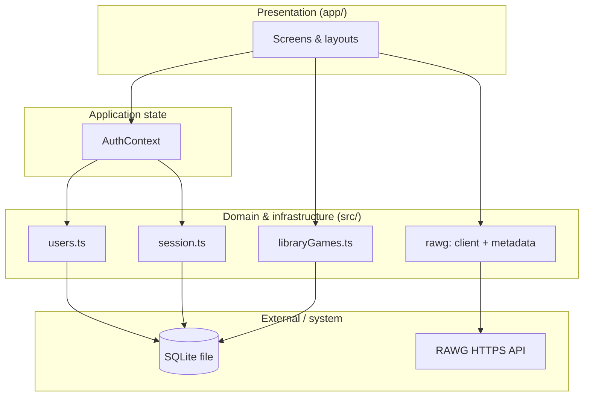
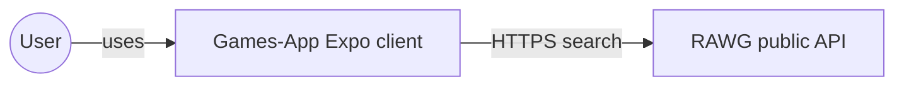
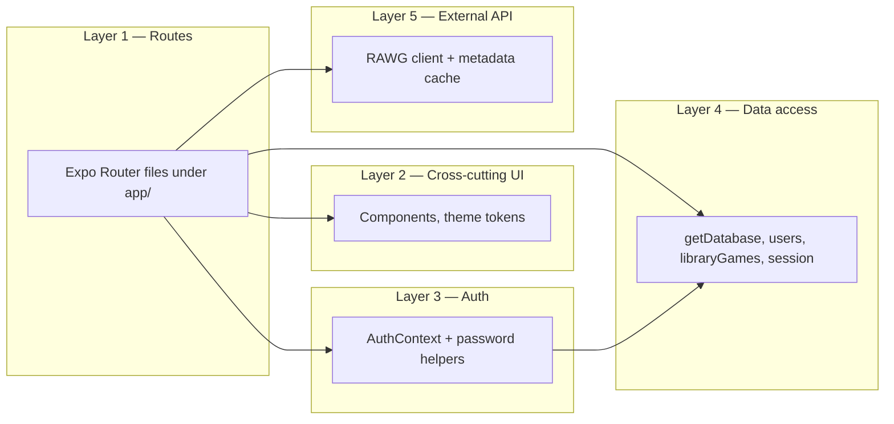
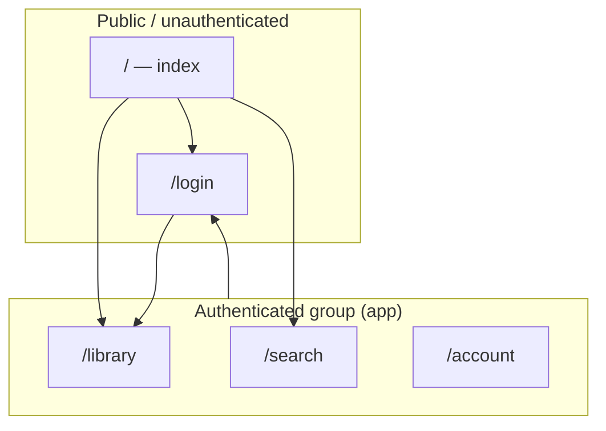
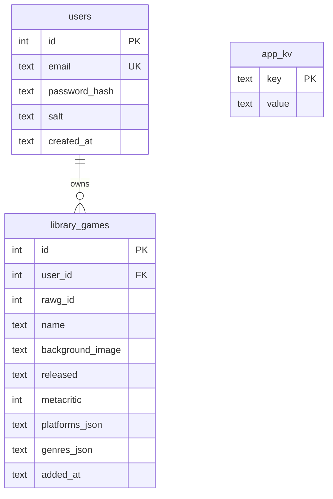
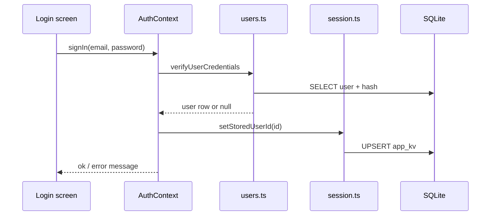
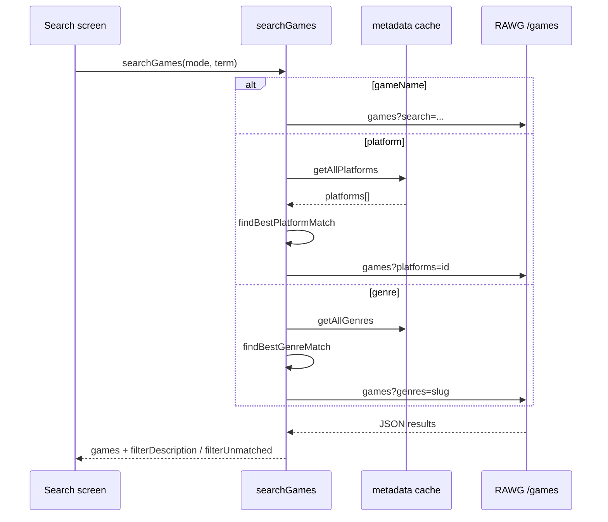

# Games DB — Technical Documentation

This document describes the **Games-App** Expo/React Native project: architecture, data flows, persistence, external APIs, and the main reasons behind implementation choices. It is intended for developers onboarding to the codebase or reviewing it for study or assessment.

---

## Table of contents

1. [Purpose and scope](#1-purpose-and-scope)
2. [Technology stack](#2-technology-stack)
3. [High-level architecture](#3-high-level-architecture)
4. [System context](#4-system-context)
5. [Application layers](#5-application-layers)
6. [Navigation model](#6-navigation-model)
7. [Data model (SQLite)](#7-data-model-sqlite)
8. [Authentication and session](#8-authentication-and-session)
9. [RAWG API integration](#9-rawg-api-integration)
10. [Screen-by-screen behaviour](#10-screen-by-screen-behaviour)
11. [Source tree and code segments](#11-source-tree-and-code-segments)
12. [Design decisions and rationale](#12-design-decisions-and-rationale)
13. [Build, environment, and quality](#13-build-environment-and-quality)
14. [Limitations and possible extensions](#14-limitations-and-possible-extensions)

---

## 1. Purpose and scope

**Games-App** is a **demo** mobile application (iOS, Android, web via Expo) that lets a user:

- Create a **local account** (no remote server).
- **Search** for video games using the public **RAWG** HTTP API.
- **Save** games into a **per-user library** stored on the device.
- **Sign out** (session cleared; data remains on device).

There is **no custom backend**. All “business” persistence is **on-device** (SQLite). The only remote system is **RAWG** for game metadata and search.

---

## 2. Technology stack

| Layer | Choice | Role |
|--------|--------|------|
| Runtime | React 19 + React Native 0.81 | UI and native bridge |
| App framework | Expo SDK 54 | Tooling, native modules, OTA-friendly workflow |
| Routing | Expo Router 6 (file-based) | URLs, stacks, layouts, deep linking readiness |
| Local DB | expo-sqlite 16 | Users, library rows, session key-value |
| Crypto | expo-crypto | Salted SHA-256 for demo password hashing |
| Gestures | react-native-gesture-handler | Required by navigation stack; root wrapper |
| External API | RAWG REST API | Game search and catalog metadata |

---

## 3. High-level architecture

The app follows a **layered** structure: **UI (Expo Router `app/`)** → **state (React context)** → **domain services (`src/db`, `src/api`)** → **SQLite / HTTPS**.



**Why this shape:** screens stay thin; SQLite and HTTP details live in `src/` so they can be tested and changed without rewriting every screen. A single `AuthContext` avoids prop-drilling session state across the tree.

---

## 4. System context

How the app sits relative to the outside world:



*(The API key is embedded in the client bundle via `EXPO_PUBLIC_*` env vars.)*

**Important:** The RAWG API key is exposed in the client (`EXPO_PUBLIC_*`). That is normal for Expo public env vars but **not** a production secret model; see [Design decisions](#12-design-decisions-and-rationale).

---

## 5. Application layers



---

## 6. Navigation model

Expo Router maps **files to routes**. A **route group** `(app)` wraps authenticated areas without changing the URL path segment in the usual way (group name is omitted from the path).



**Implementation:** `app/(app)/_layout.tsx` checks `useAuth()`. If there is no user, it renders `<Redirect href="/login" />`. That keeps **all protected screens** behind one gate instead of repeating checks in every file.

**Why Expo Router (not a hand-rolled `NavigationContainer` + stack only):** Aligns with `package.json` `main: expo-router/entry`, gives file-based routes, typed URLs (optional), and scales if you add tabs or more groups later.

---

## 7. Data model (SQLite)

Logical schema (simplified):



**Code segment — `src/db/database.ts`:** Opens a **singleton** connection, runs `PRAGMA foreign_keys = ON` (required for `ON DELETE CASCADE` to work), and issues `CREATE TABLE IF NOT EXISTS` for idempotent startup migrations.

**Why JSON columns for platforms/genres:** RAWG returns arrays of names; storing denormalized JSON keeps the library list self-contained for the UI without extra API calls when browsing the library offline.

**Why `app_kv`:** Session user id is stored as key `session_user_id` to avoid `@react-native-async-storage/async-storage`, which failed on some iOS setups (`Native module is null`). SQLite is already a dependency and works in the same JS context as other DB access.

---

## 8. Authentication and session

### Password handling (`src/auth/password.ts`)

- A random **salt** is generated (`expo-crypto` random bytes → hex).
- **SHA-256** is computed over `salt:password` (demo-appropriate; not bcrypt/scrypt).

**Why not plaintext:** Demonstrates minimal security hygiene even in a demo.

**Why not bcrypt on device:** Fewer native dependencies; keeps the stack simple for coursework/demo. Documented as non-production.

### Session flow



**Bootstrap on cold start:** `AuthProvider` calls `getDatabase()`, then `getStoredUserId()`, then `getUserById()`. If the user row is missing (e.g. DB reset), session is cleared. Splash screen hides after this completes (`SplashScreen.hideAsync()`).

---

## 9. RAWG API integration

### Endpoints used

| Concern | Endpoint | Usage |
|---------|----------|--------|
| Game lists | `GET /api/games` | `search=` (title), `platforms=` (id), `genres=` (slug) |
| Catalog | `GET /api/platforms` | Paginated; full list cached in memory |
| Catalog | `GET /api/genres` | Paginated; full list cached in memory |

### Configuration (`src/api/rawg/config.ts`)

- Reads `EXPO_PUBLIC_RAWG_API_KEY` or fallback `EXPO_PUBLIC_API_KEY`.
- Throws `RawgConfigError` if missing (clear failure vs silent empty results).

### Search pipeline (`src/api/rawg/client.ts` + `metadata.ts`)



**Why fetch full `/platforms` and `/genres`:** Hardcoded keyword maps drift from RAWG and break user expectations. Live catalogs plus fuzzy matching on **name + slug** keeps behaviour aligned with the API.

**Why in-memory cache:** One paginated fetch per session per catalog; avoids repeated network cost while typing.

**Why `SearchGamesOutput` with `filterUnmatched`:** Distinguishes “no catalog match” from “catalog matched but no games,” improving empty-state copy.

### Debouncing and cancellation (`app/(app)/search.tsx` + `useDebouncedValue`)

- **Debounce (~450 ms):** Reduces RAWG rate usage and UI churn while typing.
- **`AbortController`:** Aborts the previous in-flight `fetch` when a new search runs, avoiding out-of-order responses overwriting newer results.

---

## 10. Screen-by-screen behaviour

| Route | File | Role |
|-------|------|------|
| `/` | `app/index.tsx` | Hub: links to library, search, login or account |
| `/login` | `app/login.tsx` | Sign in / register; modal presentation on root stack |
| `/library` | `app/(app)/library.tsx` | Lists `library_games` for current user; remove deletes row |
| `/search` | `app/(app)/search.tsx` | Mode chips; debounced search; save to library |
| `/account` | `app/(app)/account.tsx` | Email display; sign out clears session row |

**Library refresh:** `useFocusEffect` refetches when the screen gains focus so returning from search shows new saves.

---

## 11. Source tree and code segments

```
Games-App/
├── app/
│   ├── _layout.tsx              # Root stack, AuthProvider, gesture root, splash
│   ├── index.tsx                # Home hub
│   ├── login.tsx                # Auth form
│   └── (app)/
│       ├── _layout.tsx          # Auth gate + stack for library/search/account
│       ├── library.tsx          # FlatList of saved games
│       ├── search.tsx           # RAWG search + save
│       └── account.tsx          # Profile + sign out
├── src/
│   ├── api/rawg/
│   │   ├── config.ts            # API key resolution
│   │   ├── client.ts            # searchGames + URL building
│   │   ├── metadata.ts          # Platform/genre catalogs + fuzzy match
│   │   ├── types.ts             # RawgGame and list shapes
│   │   ├── errors.ts            # RawgConfigError, RawgHttpError
│   │   └── index.ts             # Public exports
│   ├── auth/
│   │   ├── AuthContext.tsx      # Session + signIn/signUp/signOut
│   │   └── password.ts          # Salt + hash + verify
│   ├── components/
│   │   ├── Screen.tsx           # Safe area + padding shell
│   │   ├── PrimaryButton.tsx    # Shared button styles
│   │   ├── TextField.tsx        # Single-line input
│   │   └── GameResultCard.tsx   # Search result row + Save
│   ├── db/
│   │   ├── database.ts          # Singleton DB + schema
│   │   ├── users.ts             # Register + verify + getUserById
│   │   ├── libraryGames.ts      # CRUD library rows
│   │   └── session.ts           # app_kv session user id
│   ├── hooks/
│   │   └── useDebouncedValue.ts # Debounce hook for search
│   └── theme/
│       ├── colors.ts            # Palette tokens
│       └── spacing.ts           # Spacing scale
├── app.json                     # Expo config, plugins
├── package.json
├── tsconfig.json                # strict; path alias @/*
└── README.md                    # Quick start
```

### Notable code segments (what to read first)

1. **`app/(app)/_layout.tsx`** — Minimal **authorization boundary** (redirect vs stack).
2. **`src/auth/AuthContext.tsx`** — Single place for **session lifecycle** and error messaging for auth failures.
3. **`src/db/users.ts`** — **Registration** uniqueness and **login** verification against stored hash.
4. **`src/api/rawg/metadata.ts`** — **Catalog loading** and **matching** logic for platform/genre modes.
5. **`src/api/rawg/client.ts`** — **Orchestration** of mode-specific queries and typed **`SearchGamesOutput`**.
6. **`app/(app)/search.tsx`** — **UX glue**: debounce, loading, errors, filter hints, save flow.

---

## 12. Design decisions and rationale

| Decision | Rationale |
|----------|-----------|
| **Expo Router** | File-based routes match Expo defaults; avoids maintaining a parallel manual stack that drifted from `main` in earlier versions. |
| **SQLite for session** | AsyncStorage native module was unreliable in the user’s iOS run; session in `app_kv` reuses the same stack as users/library. |
| **No remote backend** | Explicit demo scope; avoids auth servers, deployment, and GDPR-style data processing discussions for coursework. |
| **SHA-256 + salt** | Shows understanding of salting without pulling in heavy native bcrypt. Called out as not production-grade. |
| **RAWG catalogs fetched live** | Eliminates stale hardcoded platform/genre maps and fixes “platform search doesn’t work” reports. |
| **Debounce + AbortController** | Standard pattern for search boxes; prevents thrashing the API and race conditions. |
| **`GestureHandlerRootView` at root** | Satisfies React Navigation / gesture-handler expectations on Android and iOS. |
| **Typed routes optional** | `experiments.typedRoutes` can be disabled so CI does not depend on generated `.expo/types/router.d.ts` when that file is stale. |
| **Theme tokens (`colors`, `spacing`)** | Keeps visual consistency and makes bulk restyling predictable. |

---

## 13. Build, environment, and quality

### Environment variables

- **`EXPO_PUBLIC_RAWG_API_KEY`** (preferred) or **`EXPO_PUBLIC_API_KEY`** — injected at bundle time; document in `.env` (gitignored). See `.env.example`.

### Commands

| Command | Purpose |
|---------|---------|
| `npx expo start` | Dev server |
| `npx tsc --noEmit` | Typecheck |
| `npm run lint` | ESLint via Expo config |
| `npm test` | Jest (preset `jest-expo`; add tests under `__tests__/` as needed) |

### TypeScript

- **`"strict": true`** in `tsconfig.json`.
- Path alias **`@/*`** → project root for imports like `@/src/...`.

---

## 14. Limitations and possible extensions

**Current limitations**

- **Client-side API key** — Anyone can extract it from the bundle; mitigations would be a proxy backend or RAWG key restrictions by app bundle id where supported.
- **Password hashing** — Not memory-hard; vulnerable to offline cracking if the DB file is extracted.
- **No sync** — Library and accounts do not sync across devices.
- **RAWG rate limits** — Heavy use may hit API limits; backoff and caching strategies could be added.

**Possible extensions**

- Unit tests for `metadata` matching and `users` validation.
- **SecureStore** or Keychain for tokens if a real backend appears.
- **React Query / TanStack Query** for HTTP caching and retries (adds dependency weight).
- **E2E tests** (Maestro / Detox) for critical flows.

---

## Diagram index

| Diagram | Section |
|---------|---------|
| Layered architecture flowchart | [High-level architecture](#3-high-level-architecture) |
| System context | [System context](#4-system-context) |
| Application layers | [Application layers](#5-application-layers) |
| Navigation | [Navigation model](#6-navigation-model) |
| ER diagram | [Data model](#7-data-model-sqlite) |
| Auth sequence | [Authentication and session](#8-authentication-and-session) |
| RAWG search sequence | [RAWG API integration](#9-rawg-api-integration) |

---

*Document version: aligned with the Games-App Expo SDK 54 codebase. Update this file when architecture or dependencies change materially.*
